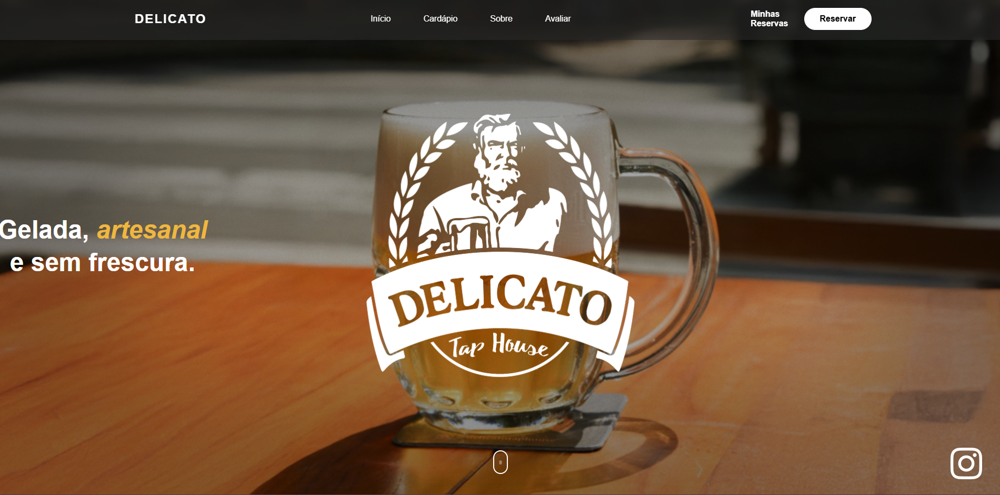
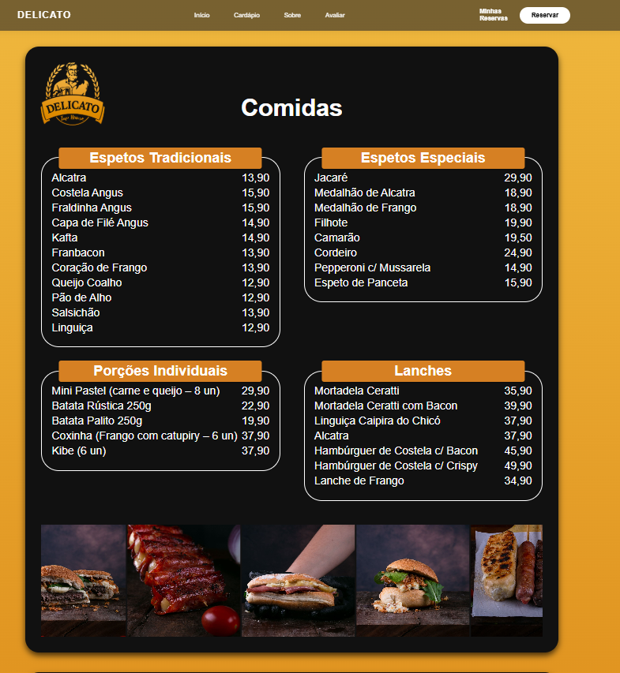
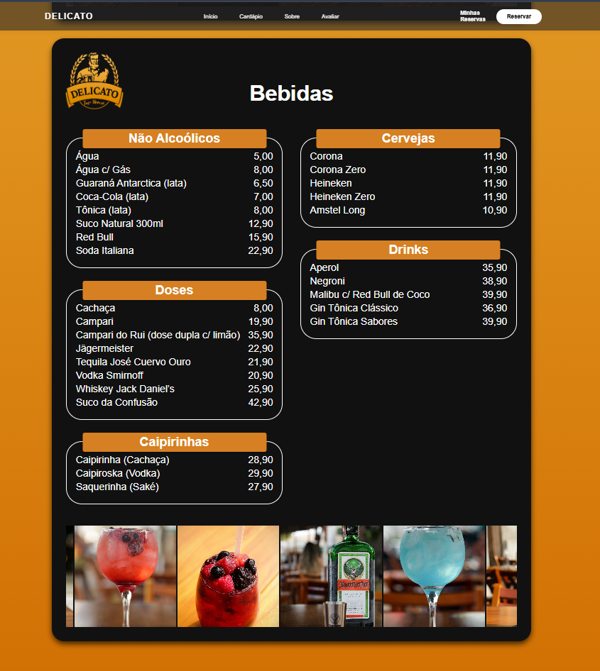
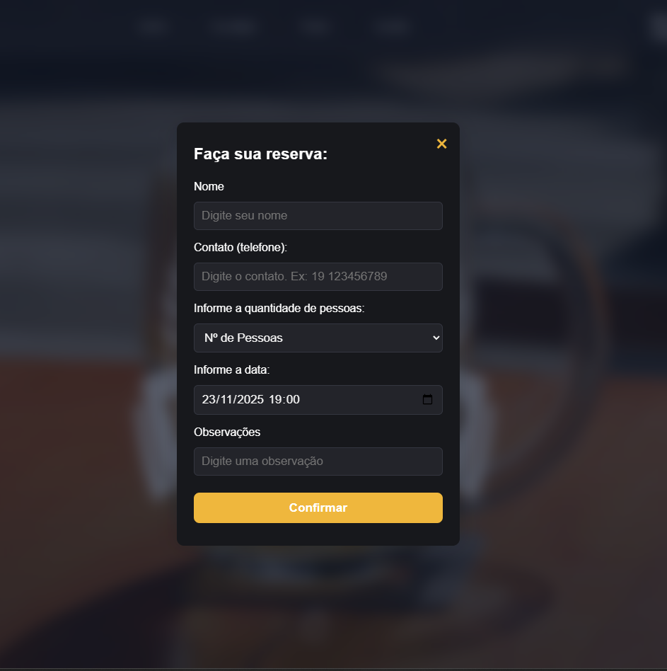
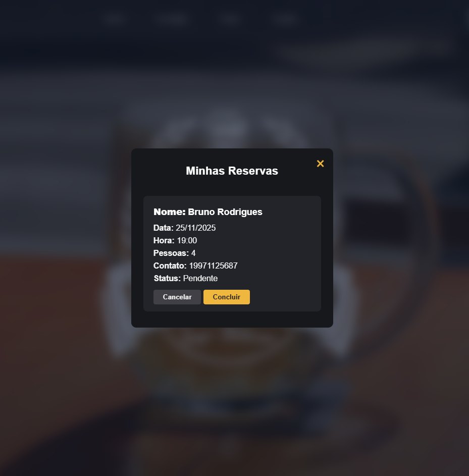

# Delicato Tap House 🍻

Aplicação web para o Delicato Tap House, uma tap house fundada em 2016, com foco em servir cerveja de qualidade em um ambiente agradável e confortável para se reunir com amigos e família, prezando um atendimento atencioso e proativo.

O projeto foi desenvolvido em **C#**, **.NET 8** e **ASP.NET Core**, com banco de dados hospedado na **Azure**, e conta com fluxo completo de visualização de cardápio, reservas, acompanhamento de reservas e área administrativa.

---

## 🎓 Contexto Acadêmico

Este é um projeto desenvolvido como trabalho final da disciplina **Projeto Interdisciplinar de Computação I**, para o bacharelado de **Ciências da Computação**, na **Escola de Engenharia de Piracicaba (EEP)**, sob orientação do professor **Clerivaldo José Roccia**.

---

## 👨‍💻 Equipe de Desenvolvimento

**Back-end / Banco de Dados / Arquitetura / Deploy**

- Bruno Carvalho Rodrigues – Responsável pelo desenvolvimento Back-end, Banco de Dados, Arquitetura e Deploy

**Front-end**

- Gustavo Zanuzzi Vicente – Front-end  
- Felipe Nogueira Silva – Front-end  
- Nicolas Myiasaka Oliveira – Front-end  
- Gabriel Oliveira – Front-end  
- Raul Bossi – Front-end  

---

## 🏠 Página Principal (Home)

A página inicial apresenta o Delicato Tap House, destacando a identidade visual da casa, um texto de boas-vindas, chamadas para reserva e atalhos para o cardápio e para a página “Sobre nós”.  
O objetivo é transmitir a atmosfera do bar e facilitar o acesso rápido às principais ações do usuário.

**Print da Home:**

---

## 📋 Página de Cardápio

A página de cardápio exibe as opções de chopes, cervejas e demais itens oferecidos pelo Delicato Tap House, organizados em categorias (por exemplo: drinks, porções, lanches etc.).  
Nessa tela, o cliente consegue explorar os produtos, conhecer estilos e preços e decidir o que mais combina com o seu momento no bar.

**Print do Cardápio:**

---

## 📅 Página de Reservas

A página de reservas permite que o cliente escolha **data**, **horário** e **quantidade de pessoas** para garantir uma mesa no Delicato Tap House.  
O fluxo é simples e direto, pensado para que a reserva seja concluída em poucos cliques, reduzindo fricção e erros.

**Print da Página de Reservas:**

---

## ✅ Página “Minhas Reservas”

Na página **“Minhas Reservas”**, o cliente acompanha todas as reservas já feitas, com informações como data, horário, quantidade de pessoas e status.  

**Print da Página “Minhas Reservas”:**

---

## 🔐 Visualização de Administrador

A visualização de administrador oferece um painel interno voltado para a equipe do Delicato Tap House.  
Nessa área é possível:

- Visualizar todas as reservas realizadas no restaurante.  
- Filtrar reservas por data, horário ou status.  
- Gerenciar os itens do cardápio (criar, editar e remover pratos/bebidas).

**Print da Visualização de Administrador:**

---

## 🧩 Tecnologias Utilizadas

- **Linguagem:** C#  
- **Framework:** .NET 8 / ASP.NET Core  
- **Banco de dados:** SQL Server (hospedado na Azure)  
- **Hospedagem do banco:** Microsoft Azure  
- **Controle de versão:** Git + GitHub  